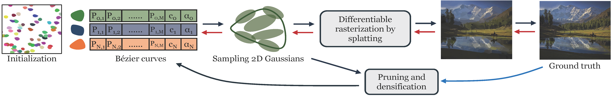

# Bézier Splatting for Fast and Differentiable Vector Graphics Rendering
[[paper](https://arxiv.org/pdf/2503.16424)][[project page](https://xiliu8006.github.io/Bezier_splatting_project/)]


This is the official implementation of our paper Bézier Splatting, an efficient and differentiable vector-graphics representation designed for high-quality image reconstruction and editing. Our method models images using a compact set of Bézier curves, combined with a novel Gaussian-based rasterization that enables fast, stable, and fully differentiable rendering. Thanks to this lightweight vector representation and our adaptive curve optimization strategy, Bézier Splatting achieves high visual fidelity with significantly reduced computation time and memory usage compared to existing differentiable vector graphics methods. Moreover, the explicit curve-based representation makes the output SVGs clean, structured, and truly editable, enabling downstream applications such as scalable dataset generation and fine-grained image manipulation. More qualitative results and details can be found in our paper. 

<div align="center">
  
</div>

## News
* **2025/9/18**: 🌟 Our paper has been accepted by NeurIPS 2025!

## Overview



Differentiable vector graphics (VGs) are widely used in image vectorization and vector synthesis, while existing representations are costly to optimize and struggle to achieve high-quality rendering results for high-resolution images. This work introduces a new differentiable VG representation, dubbed Bézier Splatting, that enables fast yet high-fidelity VG rasterization. Bézier Splatting samples 2D Gaussians along Bézier curves, which naturally provide positional gradients at object boundaries. Thanks to the efficient splatting-based differentiable rasterizer, Bézier Splatting achieves 30× and 150× faster per forward and backward rasterization step for open curves compared to DiffVG. Additionally, we introduce an adaptive pruning and densification strategy that dynamically adjusts the spatial distribution of curves to escape local minima, further improving VG quality. Furthermore, our new VG representation supports conversion to standard XML-based SVG format, enhancing interoperability with existing VG tools and pipelines. Experimental results show that Bézier Splatting significantly outperforms existing methods with better visual fidelity and significant optimization speedup. 
The project page is \href{https://xiliu8006.github.io/Bezier_splatting_project/}{\color{red!60!red} xiliu8006.github.io/Bezier\_splatting\_project}.

## Quick Started

### Cloning the Repository

The repository contains submodules, thus please check it out with 
```shell
# SSH
git clone git@github.com:Xinjie-Q/GaussianImage.git --recursive
```
or
```shell
# HTTPS
git clone https://github.com/xiliu8006/Bezier_splatting.git
```
After cloning the repository, please also down load the 2D gaussian rasterization from

```
git clone https://github.com/XingtongGe/gsplat/tree/bcca3ecae966a052e3bf8dd1ff9910cf7b8f851d
```

### Please follow GaussianImage to install gsplat

```bash
cd gsplat
pip install .[dev]
cd ../
pip install -r requirements.txt
```

If you encounter errors while installing the packages listed in requirements.txt, you can try installing each Python package individually using the pip command.

Our dataset download from [kodak](https://r0k.us/graphics/kodak/) and [DIV2K](https://data.vision.ee.ethz.ch/cvl/DIV2K/) datasets. The dataset folder is organized as follows.

```bash
├── dataset
│   | kodak 
│     ├── kodim01.png
│     ├── kodim02.png 
│     ├── ...
│   | DIV2K_HR
│     ├── 00001.png
│     ├── 00002.png
│     ├── ...
```

#### Train scripts
We provide a script to do the image vectorization for all images under one folder
```bash
bash train.sh
```
If you want to run the scripts on multi GPUs or multi nodes please run
```bash
bash train_multi_nodes.sh
```

#### Evaluation
Please refer to the follow image steps to calculate the performance, please use the correct folder path.

```
bash get_result.sh
python full_eval.py
```

#### Convert Bezier splatting to standard XML
If you want to get the XML file from our codebase, please save the gaussian model and run the following codes
```
python svg_converter.py
```
## Acknowledgments

We thank [GaussianImage](https://github.com/Xinjie-Q/GaussianImage) for providing the 2D Gaussian rasterization, our code developed from this excellent codebase.

## Citation

If you find our paper Beziersplatting is useful for your research paper, please cite

```
@inproceedings{
liu2025bzier,
title={B\'ezier Splatting for Fast and Differentiable Vector Graphics Rendering},
author={Xi Liu and Chaoyi Zhou and Nanxuan Zhao and Siyu Huang},
booktitle={The Thirty-ninth Annual Conference on Neural Information Processing Systems},
year={2025},
url={https://openreview.net/forum?id=bTclOYRfYJ}
}
```
